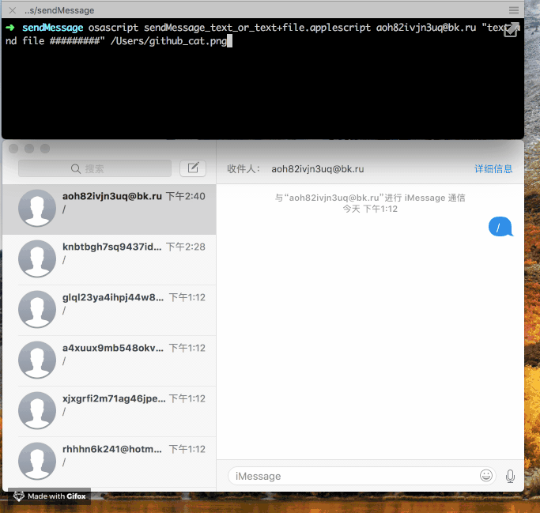

# Applescript_demos
### AppleScript简介

[AppleScript](https://en.wikipedia.org/wiki/AppleScript)由苹果开发，macOS系统自带的脚本语言。

主要功能：AppleScript通过 [Apple events](https://en.wikipedia.org/wiki/Apple_event) 进行 inter-application communication (IAC) ，将重复的任务**自动化**。

脚本编辑器：[Script Editor](https://en.wikipedia.org/wiki/AppleScript_Editor)（macOS系统自带）提供基本的调试功能。脚本编辑器可将AppleScripts保存为不同格式。

AppleScript的文件存在形式：
* 纯文本plain text (.applescript)
* 编译脚本compiled script (.scpt)
* 脚本包script bundle (.scptd)
* 应用程序application (.app)


### 反编译

编译：
在Script Editor里，编译脚本时必须不勾选 **仅运行** 选项，只有这样，编译得到的compiled script (.scpt)包含了 **编译代码** 和 **源代码**，可反编译得到applescript源代码。
在Script Editor里，编译脚本时勾选了 **仅运行** 选项，则编译后的脚本只保存编译过的 **编译代码**，不包含源代码，无法反编译得到applescript源代码。

反编译命令：
```
osadecompile  mycompiledapp.app
osadecompile  mycompiledapp.scpt
```
也可以直接使用Script Editor打开看到。

### Security

由于AppleScript的特性（系统自带、功能强大、编译代码难以反编译），已发现利用AppleScript的恶意程序样本。

### AppleScript与应用程序交互——用Applescript自动发送iMessage消息（文本/文件）
```
注意
1.不论发送什么类型的iMessage消息（文本/文件），发送目标 都必须在iMessage程序的左侧列表中已经存在“对话”才行，也可以手动“编写新消息”即可在列表中添加一个“对话”
2.发送目标存在并开启iMessage消息时才可以成功发给对方
3.使用该脚本频繁发送iMessage消息给陌生人有可能影响到iCloud账号安全！其他看文件内的相应注释
```

###### sendMessage_text_or_text+file.applescript
```bash
命令行中输入命令:
osascript sendMessage_text_or_text+file.applescript hasexisted@icloud.com "1111111111111111111111111111111111" "NoAttachment" 
功能：只发送文本消息 不发送文件

osascript sendMessage_text_or_text+file.applescript hasexisted@icloud.com "send this text and a file" /Users/xx/Downloads/xx.sh
功能：发送文本消息 同时紧跟着发送文件
```

###### sendMessage_text_or_text+file.applescript
```
可用脚本编辑器Script Editor.app直接编辑 发送 文本消息(间隔几秒 循环发送)
```

###### sendMessage_random_file.scpt
```
随机发送文件（xx用户的Downloads:tmp文件夹下的文件）
```

###### sendMessage_only_text.applescript
```bash
命令行中输入命令发送 文本消息
osascript sendMessage_only_text.applescript 13699992222  "Hello there"
```

##### 使用效果演示


